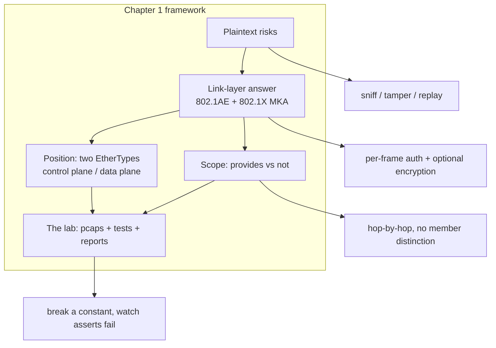

## 本章小结

本章作为全书的开篇，回答了"MACsec 是什么、为什么需要它、边界在哪里、本书如何验证"四个问题，为后续深入学习奠定了认知基础。

### 1. 核心要点回顾

**明文以太网的风险**：原生以太网帧可被链路上任何人嗅探、篡改、重放，且不需要攻破任何密码学；上层加密覆盖不全，链路层一次性解决才是出路。

**网络栈中的位置**：MACsec 工作在链路层，控制面（EAPOL `0x888E` 里的 MKA，Packet Type 5）与数据面（`0x88E5` 的 SecTAG + Secure Data + ICV）两个 EtherType 划分两个平面；对上层完全透明，不需要 IP 可达。

**能力边界**：提供帧完整性、可选机密性、CA 内源认证与抗重放；不提供端到端保护、成员间可区分认证、抗流量分析与可用性。逐跳的本质决定了它与 IPsec/TLS 互补。

**可验证的实验室**：15 个参考抓包 + 35 项与 IEEE 向量逐字节对齐的测试 + 15 份字段级报告构成证据链；构造帧而非内核卸载的原因是 WSL2 内核未开 `CONFIG_MACSEC`。

### 2. 知识框架

下面是本章的核心逻辑结构。

图 1-1：第一章知识框架

### 3. 延伸思考

1. 你的网络里，哪些流量今天仍以明文走过交换机？如果开 MACsec，保护范围会止于哪里？
2. "CA 内源认证"无法区分成员——在你的环境里，这是可接受的代价还是必须弥补的缺口？
3. 如果只能选一条论断去实验室验证，你会选密钥派生、ICV 还是重放窗口？为什么？

## 与后续章节的关联

- **后续章节深化**：[第二章](../02_key_hierarchy/README.md)拆开密钥体系（CAK/CKN/KEK/ICK/SAK），解释这些服务如何被密钥支撑
- **框架指导**：[第五章](../05_wire_format/README.md)把两个平面的承诺落到逐字节；[第九章](../09_attacks/README.md)把"不提供"一列展开为攻击面
- **动手路径**：[第十章](../10_lab/README.md)是实验室完整操作手册

[第二章](../02_key_hierarchy/README.md)将深入密钥体系：五个密钥对象各自的角色、CAK 的两条来源（PSK 与 EAP MSK）、KDF 公式与标签，以及"SAK 不是从 CAK 派生"这个最容易搞错的事实。

---

> 📝 **发现错误或有改进建议？** 欢迎提交 [Issue](https://github.com/johnfu-ai/macsec-study-guide/issues) 或 [PR](https://github.com/johnfu-ai/macsec-study-guide/pulls)。
