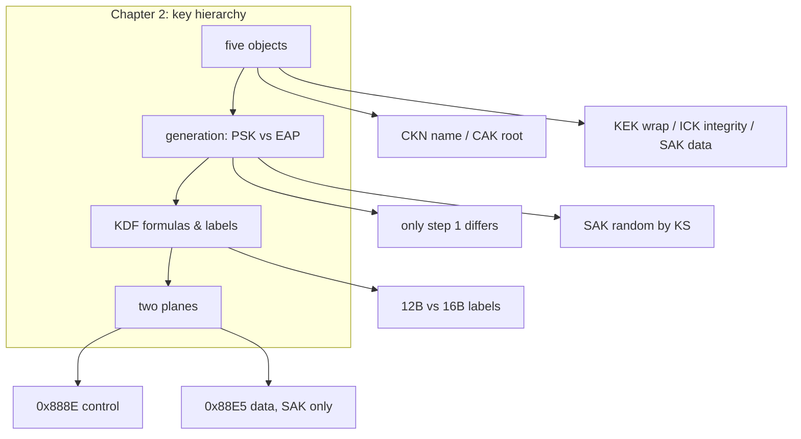

## 本章小结

本章拆解了 MACsec 密钥体系的五个对象与两条平面，这是理解后续所有协议行为的基础。

### 1. 核心要点回顾

**五个密钥对象**：CKN 是 CAK 的名字（明文可见、充当 KDF context）；CAK 是根密钥，只派生 KEK/ICK；KEK 用 AES-KeyWrap 封装 SAK；ICK 用 AES-CMAC 保护 MKPDU；SAK 是唯一接触用户流量的钥匙。

**生成关系**：PSK 与 EAP 只在"CAK/CKN 从哪来"这一步不同，之后的 MKA 流程完全相同。SAK 由 Key Server 随机生成，与 CAK 没有派生关系——线上出现的是 `AES-KeyWrap(KEK, SAK)`，不是 SAK 明文。

**KDF 公式与标签**：PRF 为 AES-CMAC（NIST SP 800-108 计数器模式）；KEK/ICK 标签 12 字节（`IEEE8021 KEK` / `IEEE8021 ICK`），EAP 派生 CAK/CKN 的标签 16 字节；mac1/mac2 按数值排序保证两端一致。

**两条平面**：控制面（MKA，`0x888E`）用 CKN/ICK/KEK；数据面（MACsec，`0x88E5`）只用 SAK。CAK/CKN/KEK/ICK 都不进入 GCM。

### 2. 知识框架

图 2-2：第二章知识框架

### 3. 延伸思考

1. 如果攻击者拿到了 CKN 但没有 CAK，能造成什么影响？能解密任何流量吗？
2. 为什么 SAK 设计成"Key Server 随机生成"而不是从 CAK 派生？两种设计在换钥频率上有什么差异？
3. KEK/ICK 的 context 用 CKN 前 16 字节——如果两个联盟的 CKN 前 16 字节相同，会发生什么？

## 与后续章节的关联

- **后续章节深化**：第三章把这些钥匙放进 SecY 的收发路径，看它们如何被使用
- **报文映射**：第五章逐字节展示 KEK 封装的 Distributed SAK 与 ICK 保护的 MKPDU 长什么样
- **生命周期**：第六章讲 SAK 这把"消耗品"如何轮换与退役

[第三章](../03_secy/README.md)将进入数据面，跟随一帧用户流量穿过 SecY 的发送与接收路径，看密钥体系如何落到每一个报文上。

---

> 📝 **发现错误或有改进建议？** 欢迎提交 [Issue](https://github.com/johnfu-ai/macsec-study-guide/issues) 或 [PR](https://github.com/johnfu-ai/macsec-study-guide/pulls)。
