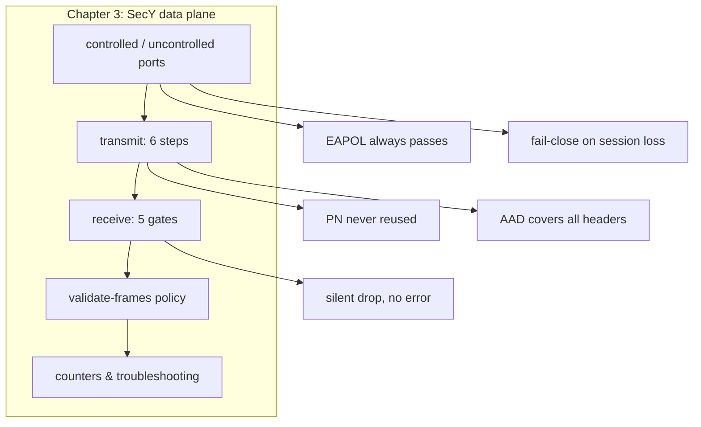

## 本章小结

本章跟随一帧流量穿过了 SecY 的发送与接收路径，把第二章的密钥体系落到了具体的处理动作上。

### 1. 核心要点回顾

**受控口与非受控口**：非受控口永远放行 EAPOL（否则密钥协商流量自己就被拦）；受控口只在 MKA 会话建立后打开，会话消失即关闭——这是 fail-close 的标准行为。

**发送路径**：六步流水线——选 SC/SA、构建 SecTAG、PN 递增（绝不复用）、GCM 加密（AAD 覆盖 DA‖SA‖0x88E5‖SecTAG‖User[0:co]）、追加 16 字节 ICV。加密范围由 E 位与 confidentiality offset 共同决定。

**接收路径**：五道关——未知 SCI、无 SA/AN 未启用、重放窗口、Delay Protect、ICV 校验；任何一道失败都**静默丢弃**，不回错误报文。

**Validate Frames**：Strict（全丢）是标准姿势；Checked/Disabled 对明文帧让步，等于把完整性降级为尽力而为，是 fail-open 的配置根源。

**计数器**：`BadTag` 指向密钥问题，`UnknownSCI` 指向会话/SCI 配置，`Late` 指向时延与 delay protect——静默丢弃的世界里，计数器是唯一的目击者。

### 2. 知识框架

图 3-4：第三章知识框架

### 3. 延伸思考

1. 如果把五道关的顺序调整为"先验 ICV 再查 SCI"，会有什么性能与安全上的后果？
2. Checked 模式下，攻击者如何利用"untagged 帧按明文接收"这条规则？防御方该怎么补救？
3. `InPktsBadTag` 缓慢增长与突然暴涨，分别更可能对应什么故障？

## 与后续章节的关联

- **后续章节深化**：第四章进入控制面，看 MKA 如何把 SAK 安全地送到 SecY 手里
- **字节级对应**：第五章将本节的 SecTAG、PN、ICV 逐比特展开
- **窗口细节**：3.3 节一笔带过的重放窗口与 Delay Protect，在第六章有两节专门展开

[第四章](../04_mka/README.md)将转向控制面 MKA 协议：Key Server 如何选举、对等体状态如何迁移、SAK 如何在 MKPDU 参数集里传递——正是这些机制让本章的 SecY 拿到了可用的钥匙。

---

> 📝 **发现错误或有改进建议？** 欢迎提交 [Issue](https://github.com/johnfu-ai/macsec-study-guide/issues) 或 [PR](https://github.com/johnfu-ai/macsec-study-guide/pulls)。
