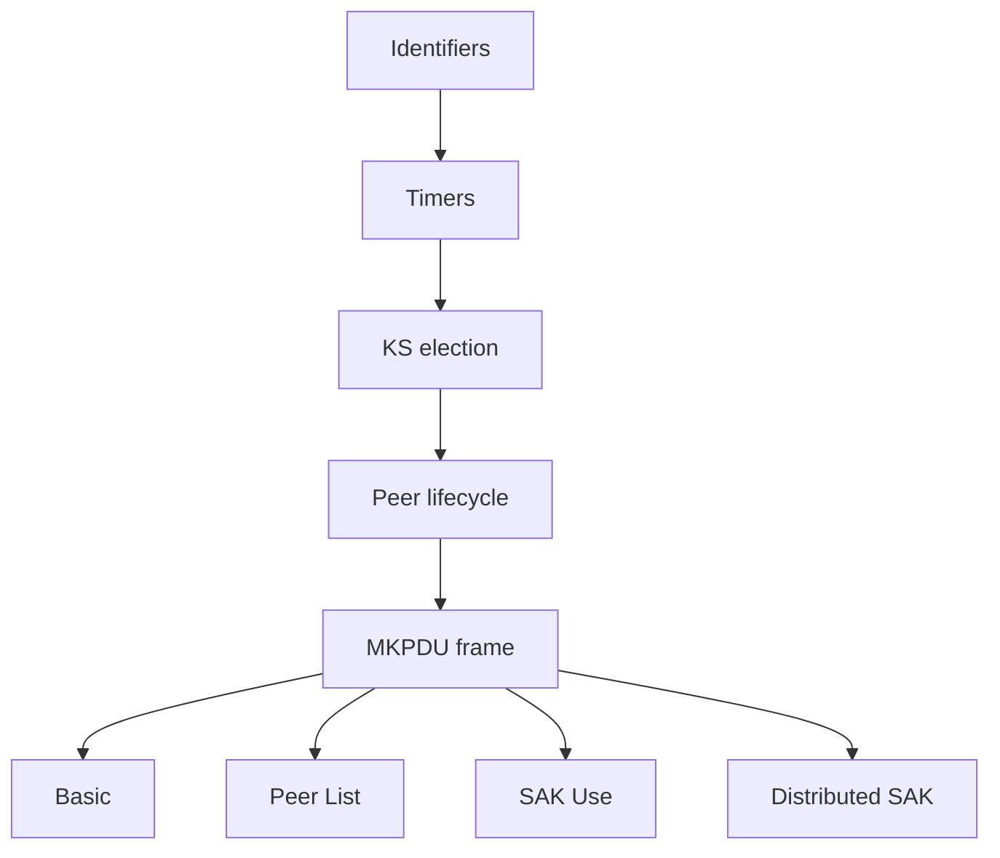

## 本章小结

本章作为 MKA 的参考手册，从标识符到参数集把控制面的每个部件过了一遍，为后续的逐字节解析提供了查表依据。

### 1. 核心要点回顾

**标识符**：CKN 是 CA 的名字而不是密钥；MI/MN 标识成员与报文序号；SCI 标识发送方向的安全通道；KI = KS 的 MI ‖ KN，是一把 SAK 的全名。MN 构成 MKA 自身的反重放。

**时间参数**：hello 2 秒、判死约 6 秒；SAK 寿命由 PN 耗尽或策略决定；换 CAK 即新 CA、旧 SAK 全部作废。

**Key Server 选举**：优先级数值最小者当选，平局比 SCI；KS 是 SAK 的唯一分发者，多成员 CA 也只有一个 KS。选举不产生额外报文，宣告本身就是投票。

**对等体生命周期**：Potential（我看见它）→ Live（互认）→ 判死摘除；晋级信号是对端列表里出现自己的 MI。

**MKPDU 结构**：EAPOL(Type 5) 里顺序拼接参数集，尾部 AES-CMAC ICV 覆盖整帧去掉 ICV；keepalive 的最小集是 Basic + Live Peer List + SAK Use + ICV Indicator + ICV。

**参数集**：Basic 宣告身份与能力；Peer List 记录对端及其 MN；SAK Use 声明收发状态与 LLPN；Distributed SAK 用 AES-KW(KEK) 封装新钥匙，同一 SAK 只分发一次。

### 2. 知识框架

图 4-2：第四章知识框架

### 3. 延伸思考

1. 如果两台设备的 KS 优先级与 SCI 都完全相同，选举会陷入什么局面？现实中这种配置可能怎样被误配出来？
2. MN 反重放与数据面 PN 反重放的威胁模型有何不同——重放一条 MKPDU 与重放一帧密文，各自能造成什么后果？
3. keepalive 每 2 秒全量携带 Live Peer List，在成员众多的 CA 里这个设计会遇到什么伸缩性问题？

## 与后续章节的关联

- **逐字节展开**：[第五章](../05_wire_format/README.md)把本章的字段表套到真实抓包的每一个字节上
- **生命周期**：SAK Use 里的 AN/LLPN 字段在[第六章](../06_lifecycle/README.md)的换钥与 Delay Protect 故事里扮演主角
- **套件协商**：Distributed SAK 携带的套件 ID 在[第七章](../07_cipher_suites/README.md)展开

[第五章](../05_wire_format/README.md)将以 `session-full.pcap` 的 13 帧为素材，把 MKA 握手与 MACsec 数据面逐字段、逐十六进制字节地走一遍——本章的表格就是那场旅行的地图。

---

> 📝 **发现错误或有改进建议？** 欢迎提交 [Issue](https://github.com/johnfu-ai/macsec-study-guide/issues) 或 [PR](https://github.com/johnfu-ai/macsec-study-guide/pulls)。
