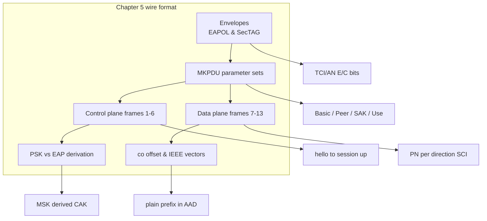

## 本章小结

本章把 MACsec/MKA 的全部报文拆到了字节级：先看清两条平面的信封（EAPOL 头与 SecTAG），再逐个拆参数集，最后把 `session-full.pcap` 的 13 帧逐帧解析，并以 confidentiality offset 和 IEEE 向量收尾。

### 1. 核心要点回顾

**EAPOL 头与 SecTAG**：MKA 跑在 EAPOL type 5 上（type 6 是 Announcement）；MACsec 帧 EtherType `0x88E5` 且算在 SecTAG 内、进 AAD。TCI 一个字节同时编码了 SC/ES（SCI 在不在线上）与 E/C（加密还是仅完整性）。

**MKA 参数集**：Basic 永远第一（首字节是版本不是 type）；Peer List 区分 Live/Potential；Distributed SAK 用 AES-KeyWrap(KEK) 封装 16 字节 SAK；SAK Use 的 Latest/Old tx/rx 位就是会话状态的账本。ICV 用 AES-CMAC(ICK) 盖住整帧。

**控制面六帧**：hello 自荐 → Potential Peer + 选举落定 → KS 三合一帧分发 SAK → 对端 tx+rx → 双方 tx+rx 会话建立 → keepalive。每一帧的偏移表都能在 Wireshark 里对照验证。

**数据面七帧**：加密 ICMP 的 PN 逐帧递增，两个方向各有一条 SC、各自的 SCI 与序号空间；帧 13 用 ES=1 省掉线上 SCI，但 GCM IV 仍用完整 SCI。

**PSK 与 EAP**：MKA 报文完全同构，差别只在 CAK 来源（预配置 vs 从 MSK 派生）与 Key Server 归属（比优先级 vs Authenticator 天然当选）。

**Confidentiality Offset 与向量**：co=30/50 把五元组留在明文供 ECMP 哈希，代价是泄露元数据；co 不在帧上而在 Distributed SAK 里。全部密码学与 IEEE 公开测试向量逐字节对齐。

### 2. 知识框架

下面是本章的核心逻辑结构。

图 5-3：第五章知识框架

### 3. 延伸思考

1. 把帧 3 的 Distributed SAK 字节改成任意一位，Wireshark 里会发生什么——ICV 先挂，还是解包先挂？
2. 如果一个抓包里同时出现 type 5 和 type 6 的 EAPOL，怎样最快区分哪个是 MKA？
3. co=30 的部署里，攻击者能从明文前缀读出哪些信息？这对流量分析意味着什么？

## 与后续章节的关联

- **后续章节深化**：[第六章](../06_lifecycle/README.md)在本章的静态格式之上引入时间维度——同一套参数集如何驱动换钥、重放窗口与判死
- **套件展开**：[第七章](../07_cipher_suites/README.md)展开 Distributed SAK 里那 8 字节套件 ID 的意义（GCM-AES-256 / XPN）
- **动手验证**：[第十章](../10_lab/README.md)给出把这些帧在 Wireshark 里逐字节复现的具体步骤

[第六章](../06_lifecycle/README.md)将跟踪密钥的一生：从换钥时 AN=0 → AN=1 的双 SA 并存，到重放窗口的四种裁决，再到 Delay Protect 如何堵住"截留后择机放出"的盲区。

---

> 📝 **发现错误或有改进建议？** 欢迎提交 [Issue](https://github.com/johnfu-ai/macsec-study-guide/issues) 或 [PR](https://github.com/johnfu-ai/macsec-study-guide/pulls)。
