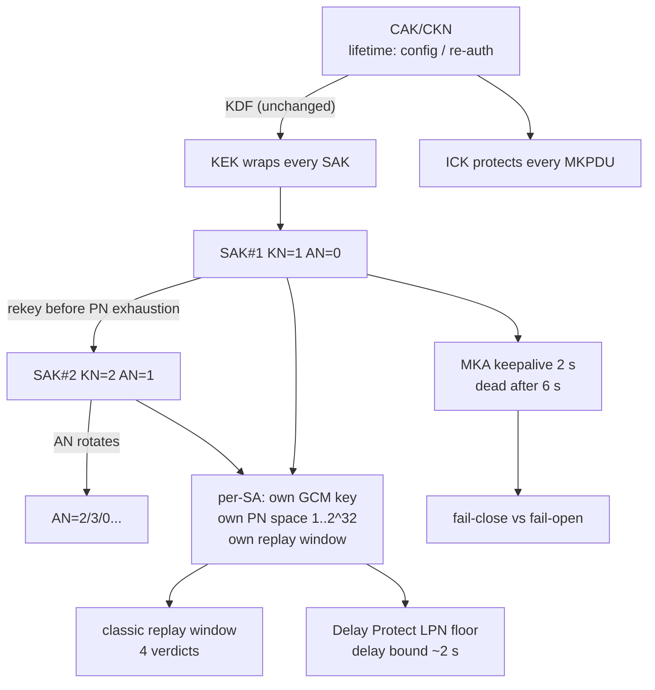

## 本章小结

本章围绕 `mka-rekey.pcap`、`macsec-replay.pcap` 与 `mka-delay-protect.pcap` 三份抓包，讲完了 SAK 从上岗到退役的完整生命周期，以及接收端两道抗重放防线的分工。

### 1. 核心要点回顾

**为什么要换钥**：GCM nonce = SAK ‖ (SCI ‖ PN)，同一 SAK 上 PN 不得重复；32-bit PN 在高速线速下几分钟甚至几十秒就耗尽，Key Server 必须提前分发新 SAK。XPN 套件用 64-bit PN 把这个问题推后到几乎不会发生。

**换钥时线上发生什么**：Key Server 随机生成新 SAK，照旧 AES-KeyWrap(KEK) 分发；AN 0→1 轮转、KN 递增；过渡期双 SA 并存（latest/old），旧 SA 先转 rx-only 再以 old KN=0 退役；PN 每 SA 独立计数，新 SA 的 PN 从 1 重新开始不是重放。

**抗重放窗口**：接收端以 `next` 与窗口宽度 `W` 对每个到达 PN 做四种裁决（按序接受/乱序接受/低于下沿丢弃/重复丢弃）。重放帧是合法帧的逐字节拷贝，ICV 层面毫无破绽——重放检测是序列策略，不是密码学。

**Delay Protect**：经典窗口拦不住"被截留后择机放出"的帧；接收方在 SAK Use 里周期宣告 LLPN 下沿，低于它的帧一律拒收，把重放延迟限死在约一个 MKA 周期（2 s）内，代价是高时延路径上的真帧也可能被误杀。

**保活、判死与数据面存亡**：MKA 每 2 s 保活、约 6 s 判死；控制面消失后 SecY 只有 fail-close（标准期望）与 fail-open（降级风险）两种命运。

### 2. 知识框架

图 6-2：第六章知识框架

### 3. 延伸思考

1. 如果把窗口宽度 `W` 设成 0（严格模式），网络轻微乱序会发生什么？运维上如何权衡？
2. Delay Protect 的 LLPN 宣告依赖 MKA 周期——如果 MKA 报文本身被选择性丢弃，防线还能生效吗？
3. 一次失败的换钥（Distributed SAK 丢失）会在数据面上表现出什么现象？结合 6.2 节的时序推演。

## 与后续章节的关联

- **后续章节深化**：换钥的密码学细节（AES-KeyWrap、GCM nonce 构造）在[第七章](../07_cipher_suites/README.md)展开；本章提到的截留重放、fail-open 降级，在[第九章](../09_attacks/README.md)作为攻击面逐一分析。
- **动手验证**：`mka-rekey.pcap` 过滤 `mka || macsec`，盯住 `macsec.an` 与 SAK Use 的 old/latest 变化；排障入口见[第十章](../10_lab/README.md)。

[第七章](../07_cipher_suites/README.md)将深入密码套件本身：GCM-AES-128/256 的格式差异、套件协商，以及 XPN 如何用 64-bit PN 与重构的 nonce 把"换钥时钟"推后。

---
> 📝 **发现错误或有改进建议？** 欢迎提交 [Issue](https://github.com/johnfu-ai/macsec-study-guide/issues) 或 [PR](https://github.com/johnfu-ai/macsec-study-guide/pulls)。
