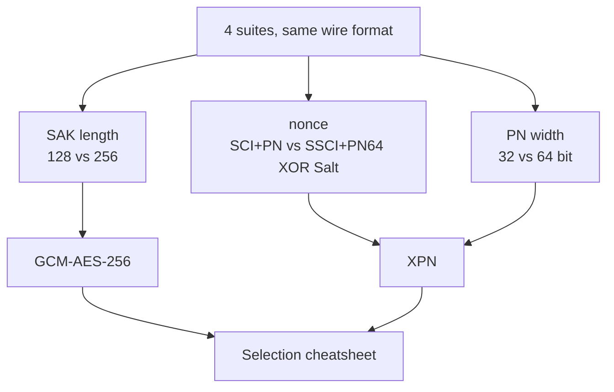

## 本章小结

本章围绕"四个套件只差三处"这条主线，把 SAK 长度、nonce 构造与 PN 位数的差异逐一看过，并用 IEEE 向量与 XPN 抓包给出了可验证的证据。

### 1. 核心要点回顾

**套件协商**：Algorithm Agility 标识的是 KDF/ICV 算法族；数据面套件随 Distributed SAK 分发，默认套件 GCM-AES-128 省略 8 字节套件 ID 字段，最终选择由 Key Server 决定。

**GCM-AES-256**：只换密钥长度、不换任何格式；动机是长期安全边际而非性能；实验室用 Randall §2.1.2/§2.2.2 向量对 128 与 256 做了逐字节比对。

**XPN**：PN 扩到 64 bit 而 SecTAG 不改——线上仍是低 32 位，高位由接收端按 802.1AE 10.6 从回绕恢复；IV 改为 `(SSCI‖PN64)⊕Salt`；识别 XPN 会话的最快线索是 Live Peer List 里非 0 的 KS SSCI LSB（MKA version 3）。

**诚实边界**：XPN 没有公开的完整向量（Annex C 草案文本 ICV 留空），实验室对 XPN 只做构造级验证。

**选型**：默认 128 保互操作；合规上 256；高速率上 XPN；两端与中间设备必须同时支持。

### 2. 知识框架

图 7-1：第七章知识框架

### 3. 延伸思考

1. Salt 是公开值却仍要随 SA 安装——它防的是什么？为什么说它"不是第二把密钥"？
2. 100G 小帧场景下 32-bit PN 约 29 秒烧完：选择"更频繁换钥"而非 XPN 的部署会付出哪些代价？
3. XPN 不改 SecTAG、让接收端恢复高 32 位，这个兼容性设计的代价是什么？在什么条件下接收端可能恢复错误？

## 与后续章节的关联

- **拓扑不变量**：无论哪个套件，多成员 CA 仍是一把 SAK 共享——[第八章](../08_topology/README.md)展开组密钥视角
- **攻击面**：默认套件的 `SCI‖PN` nonce 构造是[第九章](../09_attacks/9.2_nonce_reuse.md)nonce 复用分析的前提
- **部署呼应**：NIC 卸载对四个套件的支持差异见[第十一章](../11_deployments/11.3_nic_offload.md)

[第八章](../08_topology/README.md)将离开点对点，看看三个节点共享一把 CAK 时，MKA 与 SecY 如何组织多成员 CA 与三个方向的安全通道。

---

> 📝 **发现错误或有改进建议？** 欢迎提交 [Issue](https://github.com/johnfu-ai/macsec-study-guide/issues) 或 [PR](https://github.com/johnfu-ai/macsec-study-guide/pulls)。
