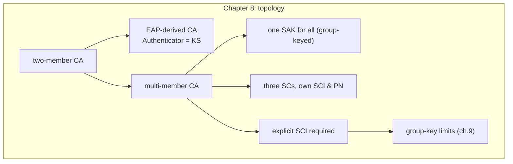

## 本章小结

本章从拓扑视角重新审视了 CA：两成员的简单情形、EAP 之后的角色结构、以及多成员的组密钥模型。

### 1. 核心要点回顾

**点对点拓扑**：node-a（KS 优先级 16）与 node-b（32）共享 PSK CAK/CKN；A 赢得 Key Server，封装 SAK 分发，双向数据用同一把 SAK。SCI = MAC‖PortID，是每个发送方向的身份证。

**EAP 之后**：Authenticator（优先级 0）与 Supplicant（255）的角色设计锁死了选举结果——认证者永远当 Key Server。CAK/CKN 从 MSK 派生，但其后的 MKPDU 与 PSK 路线完全相同。

**多成员 CA**：CA 是组密钥联盟——一个 Key Server、一把 SAK 发给全体；三个发送方向三条独立 SC（各自 SCI、各自 PN 空间）；每帧必须显式携带 SCI（SC=1），ES=1 省略只在两成员 CA 成立。三帧 PN=1 属于不同 SC，不构成重放。

### 2. 知识框架

图 8-4：第八章知识框架

### 3. 延伸思考

1. 四成员 CA 需要几条 SC？几把 SAK？分发流量比三成员增加多少？
2. 如果多成员 CA 里的一个成员被攻陷，攻击者能读到哪些流量？能否注入？这部分能力边界对应哪几道接收关卡失效？
3. EAP 拓扑把 KS 锁定给 Authenticator，这个设计在什么场景下会成为缺点？

## 与后续章节的关联

- **后续章节深化**：第九章正面分析组密钥"成员互相不可区分"的安全后果
- **动手验证**：第十章的 Live 实验可以把三成员拓扑搬到 netns 里线上重放
- **部署对应**：第十一章的交换机 MACsec 场景（交换机互联）正是多成员 CA 的生产形态

[第九章](../09_attacks/README.md)将转入攻击者视角：nonce 复用为什么致命、重放与延迟重放如何穿透经典窗口、降级与组密钥问题在哪里——本章建立的拓扑直觉会反复用到。

---

> 📝 **发现错误或有改进建议？** 欢迎提交 [Issue](https://github.com/johnfu-ai/macsec-study-guide/issues) 或 [PR](https://github.com/johnfu-ai/macsec-study-guide/pulls)。
