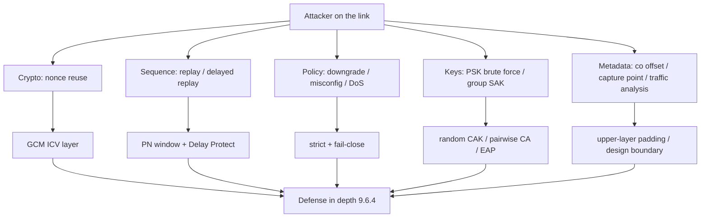

## 本章小结

本章从攻击者视角检验了 MACsec 的每道防线：从最致命的 GCM nonce 复用，到不碰密码学的降级与控制面 DoS，再到组密钥的结构性限制与元数据泄露，最后汇总成分层防线表。

### 1. 核心要点回顾

**威胁模型**：对手是"能在链路上收发帧的任何人"；MACsec 提供帧完整性、可选机密性、CA 内源认证与抗重放，不提供端到端保护、匿名性、成员间可区分认证与可用性。

**GCM nonce 复用**：同一 SC 里 PN 复用即 nonce 复用，攻击者可恢复认证子密钥、伪造任意帧；整个 PN 生命周期管理（提前换钥、独立计数、XPN）就是为它设计的。

**经典重放与延迟重放**：原样重发的帧靠接收端四裁决窗口拦截；被截留后择机放出的帧经典窗口拦不住，要靠 Delay Protect 的 LLPN 下沿把重放延迟限死在一个 MKA 周期内。重放检测是序列策略，不是密码学。

**降级、配置错误与控制面 DoS**：fail-open 回退与 validate=disabled 让加密退化成装饰；CKN/CAK 配错表现为静默丢帧；MKA 明文组播可被选择性丢弃，6 秒判死即可断流或触发降级。

**PSK 弱口令与组密钥**：MKPDU 的 ICV 校验可离线进行，人类口令 CAK 等价于 WPA-PSK 的字典环境；全组共享 SAK 意味着任何成员都能伪造其他成员的帧，成员级问责需要两两 CA 或上层认证。

**泄露面与防线分层**：co 偏移暴露内层头部元数据；NIC 卸载造成捕获点观测误差；帧长与时序始终可见。防线自下而上分六层：GCM ICV → PN 窗口 → Delay Protect → 策略层 → 密钥层 → 组网设计。

### 2. 知识框架

图 9-1：第九章知识框架

### 3. 延伸思考

1. 你所在的网络里，MACsec 之上还叠加了哪些层（IPsec/TLS/应用层）？对照 9.6.4 的分层表找出重复防护与裸奔区。
2. 若必须在高时延链路（如卫星回传）上跑 MACsec，Delay Protect 该不该开？给出取舍依据。
3. 组密钥"成员互相不可区分"在什么业务场景下是可接受的，什么场景下必须补两两 CA 或上层认证？

## 与后续章节的关联

- **动手验证**：本章引用的每一份证据（`macsec-replay.pcap`、`mka-delay-protect.pcap`、`mka-multi-peer.pcap` 等）都可在[第十章](../10_lab/README.md)的实验室里复现与逐帧查看。
- **选型延伸**：组密钥限制与逐跳边界的应对方案（叠加 IPsec/应用层）在[第十二章](../12_comparison/README.md)展开；隐私保护的标准化进程见[第十三章](../13_standards/README.md)。

[第十章](../10_lab/README.md)将把全书的理论拉回键盘上：跑测试、开抓包、配 Wireshark、上 netns，亲手复现前面每一章看到的报文。

---
> 📝 **发现错误或有改进建议？** 欢迎提交 [Issue](https://github.com/johnfu-ai/macsec-study-guide/issues) 或 [PR](https://github.com/johnfu-ai/macsec-study-guide/pulls)。
