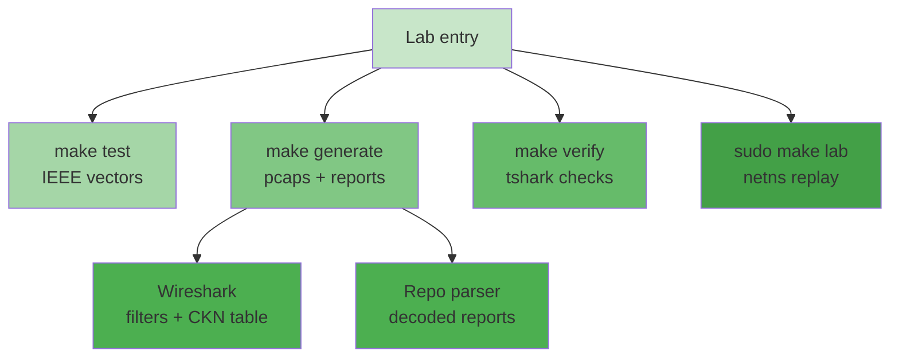

## 本章小结

本章把前面九章的纸面知识落成了可运行的证据链：三条 make 命令跑通"测试—生成—验证"，十五个参考抓包与正文章节一一对应，Wireshark 配上 CKN 表即可亲手验 ICV、解 SAK，live 实验让参考帧真正从虚拟网卡上流过一遍。

### 1. 核心要点回顾

**快速开始**：唯一依赖是 `cryptography`；`make test` 用 IEEE 官方向量裁决密码学实现（35 项），`make generate` 产出抓包与报告，`make verify` 叠加 tshark 协议识别（15 项）。改常量看断言挂掉的顺序，就是概念重要性的顺序。

**抓包导读**：每份 pcap 讲一个故事——握手、EAP 之后、换钥、co30、XPN、多成员、重放窗口、延迟保护——对照表把抓包与正文章节互为索引；`keys.json` 是全部故事线的钥匙串。

**Wireshark**：`mka`/`macsec`/`eapol.type == 5` 等过滤器定位协议帧；把 CKN/CAK 填进 MKA 首选项后，ICV 校验、SAK 解封、内层解密全部由 Wireshark 当场完成。

**Live 实验**：netns + veth + 网桥 + AF_PACKET 回放，不需要内核 MACsec 模块；网桥必须放开 `group_fwd_mask=8` 才转发 PAE 组播。

**排障**：IEEE 向量失败查 `cryptography` 安装与常量改动；`[UNVERIFIED]` 属预期、填钥即解；看不到 `mka` 查 tshark 版本；live 抓不到查 `group_fwd_mask`。

### 2. 知识框架

图 10-1：第十章知识框架

### 3. 延伸思考

1. 如果把 `keys.json` 里的 CAK 换成你随机生成的值再 `make generate`，哪些抓包会变化、哪些不会？为什么？
2. Wireshark 与本仓库解析器对同一份 pcap 的解读如有出入，你如何仲裁？（提示：`make test` 的 IEEE 向量扮演什么角色？）
3. live 实验抓回的 `live-session.pcap` 与参考抓包逐字节一致，这说明了"回放"与"捕获"的什么关系？又在什么真实场景下二者会不一致？

## 与后续章节的关联

- **后续章节深化**：第十一章把实验室推向生产——Linux 全栈、交换机与网卡卸载；第十二章在四协议之间做选型对比。
- **取证习惯迁移**：本章的"Wireshark + 解析器交叉验证"打法，在真实网络排障（11.5 节运维清单）中同样适用。

[第十一章](../11_deployments/README.md)将离开实验室，看看 MACsec 在 Linux 主机、商业交换机与智能网卡上的真实形态——协议没变，但工程约束全来了。

---

> 📝 **发现错误或有改进建议？** 欢迎提交 [Issue](https://github.com/johnfu-ai/macsec-study-guide/issues) 或 [PR](https://github.com/johnfu-ai/macsec-study-guide/pulls)。
