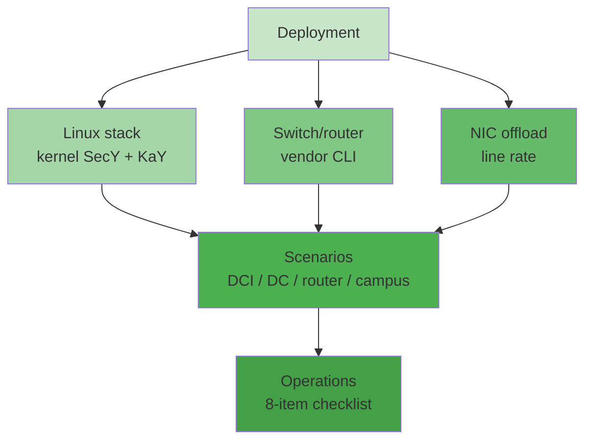

## 本章小结

本章从实验室走进生产：Linux 用内核 SecY + wpa_supplicant KaY 提供免费全栈；交换机与网卡把 MACsec 推到线速；四个典型场景覆盖了链路加密的主战场；运维清单则提前踩掉了八个高频坑。

### 1. 核心要点回顾

**Linux 全栈**：`modinfo macsec` 确认内核支持；PSK 模式下 `mka_cak`/`mka_ckn` 即仓库 `keys.json` 的演示密钥对；手工 `ip macsec` 等价于"跳过 MKA 直接装 SAK"；软件路径单核几 Gbps，万兆以上靠卸载。

**交换机**：各厂商配置语法不同、语义一致——keychain（CKN+CAK）、key-server-priority、cipher、confidentiality-offset、replay-window、fail-mode，每一项都能映射回本书前文的机制章节。

**网卡卸载**：Intel E810、ConnectX-6/7、交换 ASIC 支持 inline MACsec；`ethtool -k | grep macsec` 判断能力；卸载路径下镜像口只见密文。

**典型场景**：交换机互联（co=30）、数据中心（XPN + 卸载）、路由器 DWDM 互联（可与 IPsec 叠加）、企业有线端口（802.1X 会话密钥，较少）。

**运维清单**：MTU 同步升、控制协议放行、fail 模式取舍、重放窗口调参、PSK 轮换成本、四类监控计数、密文抓包的正确姿势、Ethertype 叠层顺序。

### 2. 知识框架



图 11-1：第十一章知识框架

### 3. 延伸思考

1. 你的网络里哪一段链路"介质不受信任"？用 11.4 节的场景对照，MACsec 与 IPsec/WireGuard 谁更贴合？
2. PSK 从 10 条链路扩到 1000 条时，运营成本曲线怎么变？何时必须切到 EAP 动态发钥？
3. fail-close 意味着 MKA 故障即业务中断——在你的可用性要求下，这个代价换来的安全收益值不值？

## 与后续章节的关联

- **选型衔接**：本章回答"怎么部署"，[第十二章](../12_comparison/README.md)回答"该不该选 MACsec"——四协议横向对比与叠加策略。
- **从仓库到真实网络的学习路径**：

```
看懂帧与钥（本书正文 + pcaps）
  → make lab 回放到 veth（scripts/run-lab.sh）
  → 有 CONFIG_MACSEC 的机器上跑 wpa_supplicant + ip macsec
  → 两台真交换机间配 PSK MACsec，抓 MKA 与 0x88E5 对照 keys.json 的派生
```

[第十二章](../12_comparison/README.md)将把 MACsec 放回更大的图景：与 IPsec、TLS、WireGuard 逐维度对比，给出选型决策与分层叠加的原则。

---

> 📝 **发现错误或有改进建议？** 欢迎提交 [Issue](https://github.com/johnfu-ai/macsec-study-guide/issues) 或 [PR](https://github.com/johnfu-ai/macsec-study-guide/pulls)。
