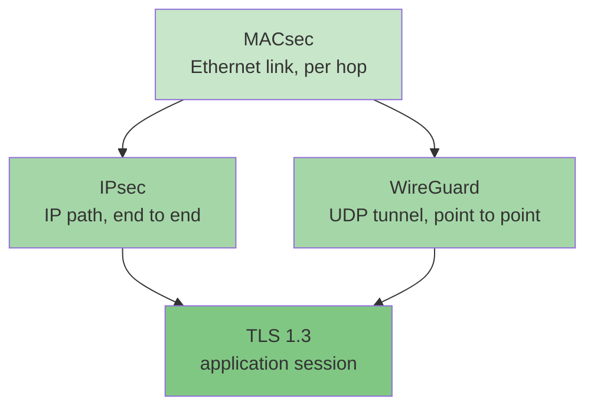

# 第十二章 与 IPsec/TLS/WireGuard 对比

同一个问题——"把流量保护起来"——在网络栈的不同层有不同的答案。MACsec 守链路，IPsec 守路径，TLS 守连接，WireGuard 守隧道。本章把四个主流协议摆在一起对照：先横向总表，再逐对细看，最后给出选型与叠加的原则。选型不是"哪个更强"，而是"信任边界在哪里"。

本章主要内容包括：

- **12.1 四协议横向总表**：标准、握手、数据面、密钥来源、PFS、开销逐行对照
- **12.2 MACsec vs IPsec**：链路与路径之辨，PSK 语义的关键差异
- **12.3 MACsec vs TLS 与 WireGuard**：连接粒度 vs 链路粒度，组密钥 vs 静态公钥
- **12.4 怎么选：叠加使用**：按需求选首选项，按信任边界分层叠加

通过本章的学习，读者将能够为给定的网络与威胁模型选出合适的加密协议（组合），并说清每一层的保护范围与代价。IPsec 部分对照姊妹仓库 [ipsec-study-guide](https://github.com/johnfu-ai/ipsec-study-guide)。

