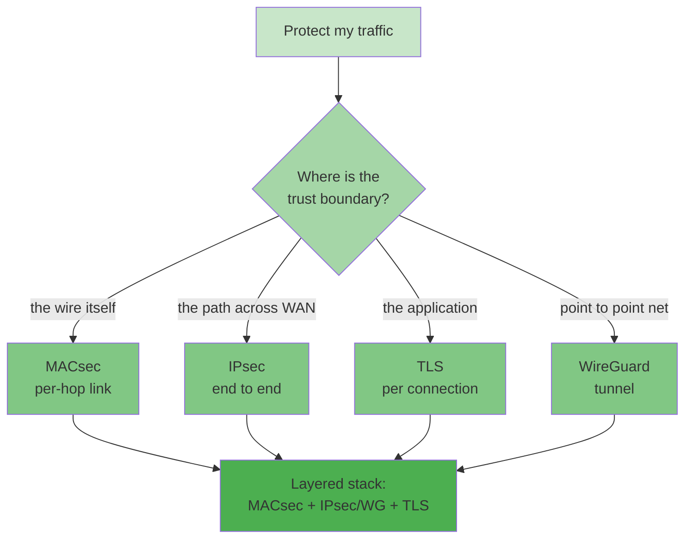

## 本章小结

本章把 MACsec 放回四协议的坐标系：MACsec 守链路（每跳、组密钥、无 PFS）、IPsec 守路径（端到端、DH 有 PFS）、TLS 守连接（应用身份）、WireGuard 守隧道（极简点对点）。选型的本质是确认信任边界，而叠加使用则是把每层协议用在它最擅长的边界上。

### 1. 核心要点回顾

**横向总表**：四协议在层、握手、数据面、序号/nonce、完整性范围、粒度、PFS、组播、抗重放、NAT、MTU、卸载、场景十几个维度上的差异一目了然；MACsec 的结构性劣势是无 PFS，结构性优势是原生组播与全流量无差别保护。

**vs IPsec**：MACsec 保护"链路"、IPsec 保护"路径"；两者的"PSK"都只是根材料，但 MACsec 的 SAK 由 KS 随机生成再分发，IPsec 的 ESP 密钥从 IKE keymat 派生；32 位 PN 让 MACsec 的换钥成为常态。

**vs TLS/WireGuard**：TLS 连接粒度 + 证书身份，MACsec 链路粒度 + 组成员身份；WireGuard 点对点静态公钥、无 IP 依赖的 MACsec 可在纯以太网段上跑。

**怎么选与叠加**：按需求查表选首选；按信任边界分层叠加——物理链路 MACsec、跨域 IPsec/WG、应用 TLS；同一跳不套两层同功能保护，MTU 与密码学开销逐层累计。

### 2. 知识框架

图 12-1：第十二章知识框架

### 3. 延伸思考

1. 你的组织里已经存在哪几层加密？是否存在"同一跳两层同功能保护"的浪费，或某段介质上的明文盲区？
2. MACsec 无 PFS 在你的威胁模型里是否可接受？（提示：谁能长期接触链路并留存密文？CAK 轮换周期多长？）
3. 如果合规要求"介质上全部密文"，为什么单靠 TLS 或 IPsec 通常不够？（提示：ARP、LLDP、其他 EtherType 走哪一层？）

## 与后续章节的关联

- **标准收官**：[第十三章](../13_standards/README.md)回望 2006-2026 的标准演进——四套件、XPN、delay protect 这些本章反复出现的名词，都对应着一份修订案。
- **姊妹仓库**：IPsec 侧的抓包与解析见 [ipsec-study-guide](https://github.com/johnfu-ai/ipsec-study-guide)。

[第十三章](../13_standards/README.md)将以标准时间线收束全书：802.1AE 与 802.1X 的历次修订分别解决了什么问题，以及按条款索骥的阅读地图。

---

> 📝 **发现错误或有改进建议？** 欢迎提交 [Issue](https://github.com/johnfu-ai/macsec-study-guide/issues) 或 [PR](https://github.com/johnfu-ai/macsec-study-guide/pulls)。
