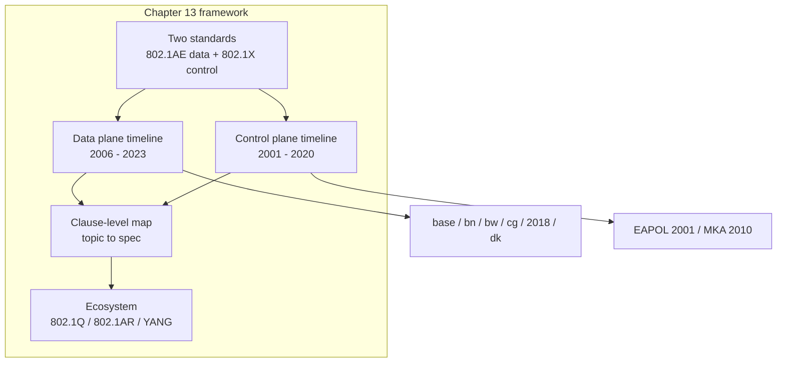

## 本章小结

本章梳理了 MACsec 双标准的二十年演进，并给出条款级对照表，让"查标准原文"变成一件有章可循的事。

### 1. 核心要点回顾

**802.1AE（数据面）**：2006 基础版（SecY/SecTAG/GCM-AES-128）→ 2011 bn（256）→ 2013 bw（XPN 64 位 PN）→ 2017 cg（EDE/多发送 SC）→ 2018 合订现行版 → 2023 dk（MAC 隐私保护），修订与 Ascon 轻量套件进行中。

**802.1X（控制面）**：2001 EAPOL 接入认证 → 2010 MKA 进入标准 → 2020 现行版。MKA 的"迟到"解释了 PSK 手工配钥传统的长寿与 EAP 模式的复用逻辑。

**周边与条款对照**：802.1Q 的组地址规则、802.1AR DevID、RFC 9191 管理模型各司其职；条款级对照表把本书每个主题映射到 802.1AE-2018 / 802.1X-2020 的具体条款与仓库代码。

### 2. 知识框架

下面是本章的核心逻辑结构。

图 13-1：第十三章知识框架

### 3. 延伸思考

1. 如果要给一台 10G 交换机互联链路选套件，2013 年前与后的答案有何不同？为什么？
2. "2006 版没有密钥协商"——这一空白如何塑造了今天 PSK 配置仍普遍存在的现实？
3. 查一条你最关心的特性（比如 confidentiality offset），在上面的对照表里找到条款号，再去标准原文验证一遍。

## 与后续章节的关联

- **回望正文**：对照表中的每一行都指向正文章节——密钥（[第二章](../02_key_hierarchy/README.md)）、字节级（[第五章](../05_wire_format/README.md)）、生命周期（[第六章](../06_lifecycle/README.md)）、套件（[第七章](../07_cipher_suites/README.md)）
- **参考资料**：[附录](../14_appendix/README.md)提供术语表、FAQ、实验室规格与字段级报告，可作为读标准时的常备速查

[附录](../14_appendix/README.md)汇总全书参考资料：80+ 条中英对照术语、36 问 FAQ、实验室规格说明，以及 15 份按字段偏移解析的抓包报告。

---

> 📝 **发现错误或有改进建议？** 欢迎提交 [Issue](https://github.com/johnfu-ai/macsec-study-guide/issues) 或 [PR](https://github.com/johnfu-ai/macsec-study-guide/pulls)。
