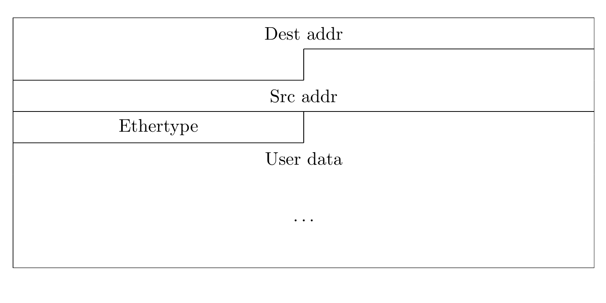
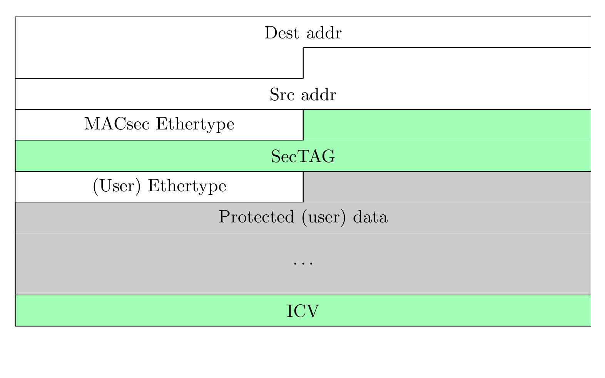
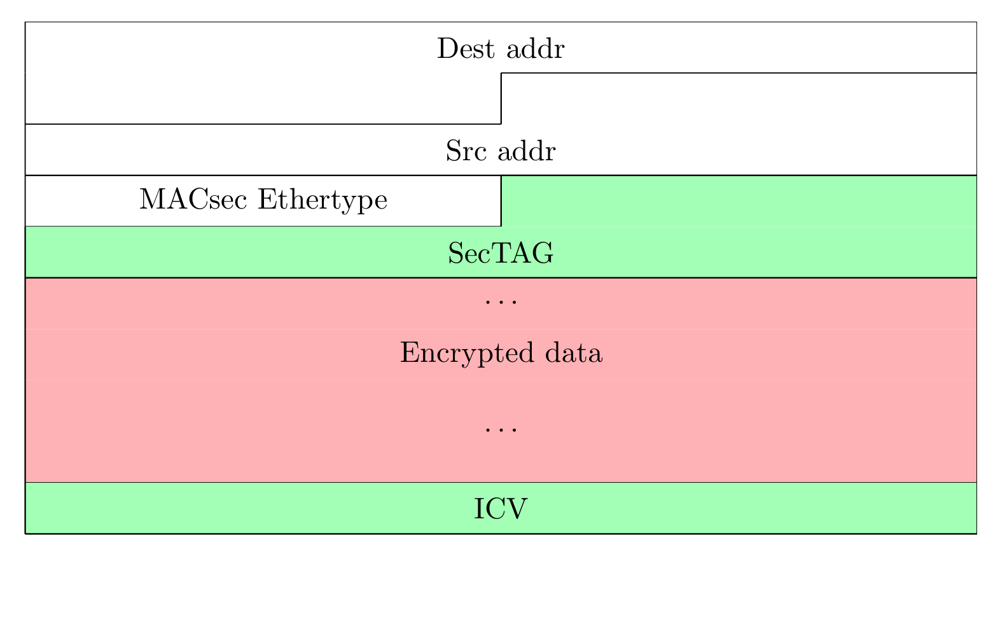
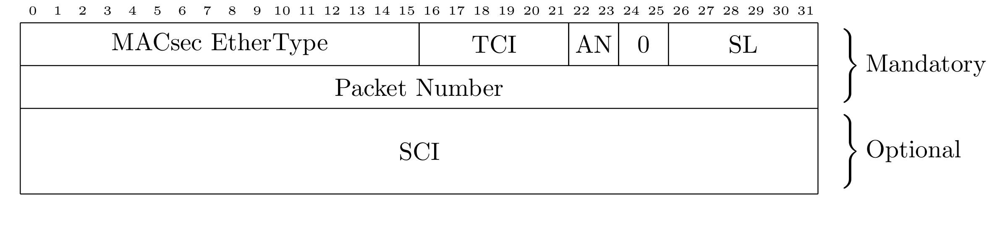
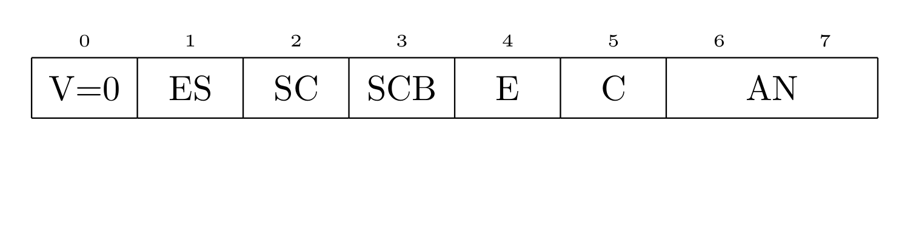
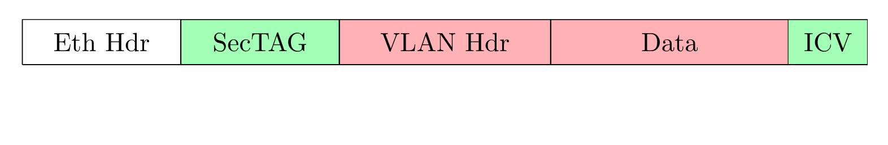
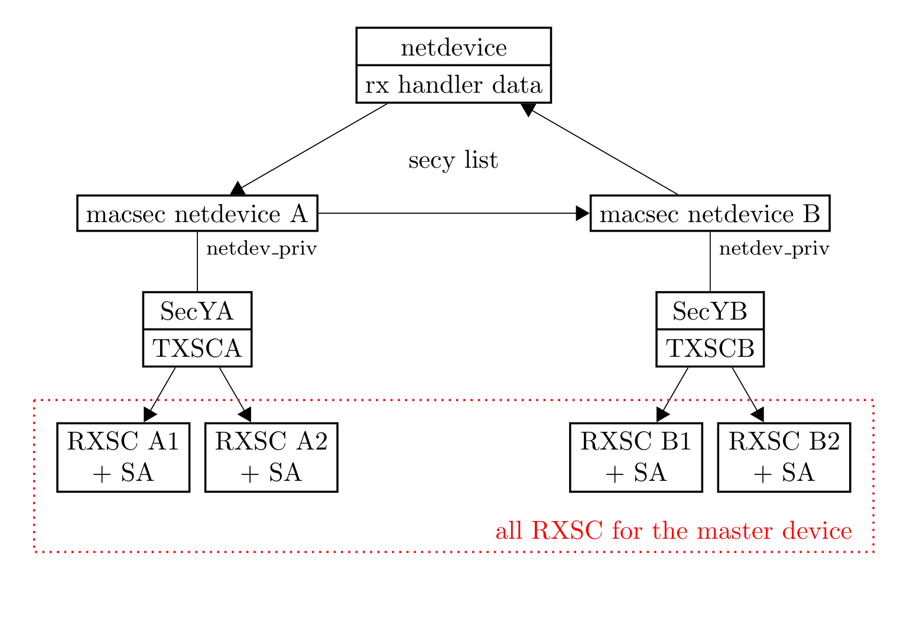
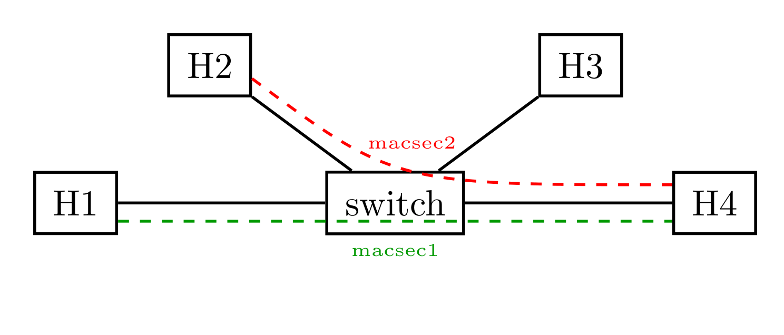
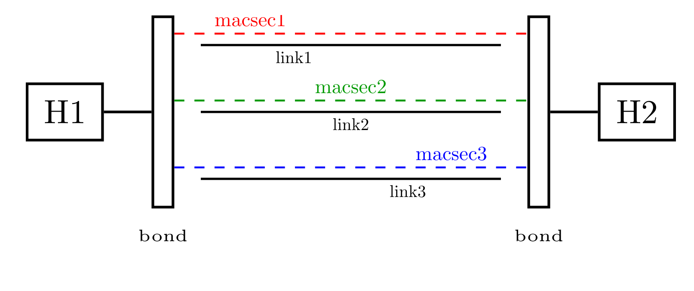
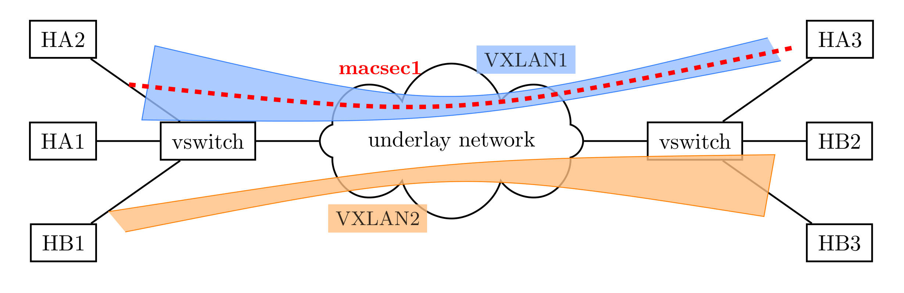

# 附录 E：经典论文全译——MACsec: Encryption for the wired LAN

> **原文**：Sabrina Dubroca（Red Hat 网络服务团队，苏黎世）, *MACsec: Encryption for the wired LAN*,
> Proceedings of netdev 1.1, Feb 10–12, 2016, Seville, Spain.
> **原文 PDF**：<https://netdevconf.info/1.1/proceedings/papers/MACsec-Encryption-for-the-wired-LAN.pdf>
> **联系方式**（照录原文）：sd@queasysnail.net · sdubroca@redhat.com

这篇论文是 **Linux 内核 MACsec 实现的设计文档**：论文宣读于 2016 年 2 月，几周后实现即随 **Linux 4.6** 进入主线，此后十年的 GCM-AES-256、XPN、硬件卸载等演进都发端于此。对本书而言，它是把[第一章](../01_intro/README.md)到[第十一章](../11_deployments/README.md)串起来的"历史原点"。

本附录将论文**全文完整译出**：摘要、正文、全部 10 幅插图（自原文 PDF 矢量图形以 432 DPI 重新渲染，即书页上的高清图 E-1 至 E-10）、4 段配置清单与 4 条脚注一一保留。论文写作于 2016 年，部分论断已经过时——凡此处在译文中以 **🗓 译注（2026）** 随文标注核对结果，文末 E.10 节给出完整的"未来工作 vs. 现实"对照表。译文与论断有出入时，以原文 PDF 为准。

---

## E.1 摘要

> **MACsec: Encryption for the wired LAN**
> Sabrina Dubroca
> Networking Services Team, Red Hat, Zurich, Switzerland
> sd@queasysnail.net, sdubroca@redhat.com

**摘要**：MACsec 是一项针对有线以太局域网安全的 IEEE 标准。MACsec 提供真实性与完整性保障，以及可选的二层载荷加密。作为一个二层规范，它为局域网内的**全部**流量提供这些保障——包括 ARP 或邻居发现、VLAN 头，以及 LACP。MACsec 可以单独使用，也可以与 802.1X 结合，由后者提供认证、安全密钥分发与参与者发现。

本文概述 MACsec 及其体系结构，描述**当时提交合入 Linux 内核的实现**，给出若干使用场景与 iproute2 配置示例，并列出内核与用户态两侧的一些后续工作。

**关键词**：MACsec、L2、加密、安全、虚拟设备

> 🗓 **译注（2026）**：文中"提交合入 Linux 内核的实现"（the proposed implementation submitted for inclusion in the Linux kernel）于 2016 年 3 月合入主线，随 **Linux 4.6**（2016 年 5 月发布）首次与用户见面。Linux 侧 MACsec 的十年演进时间线见 E.10 节的核对表。

## E.2 引言

MACsec 是一个 IEEE 标准 [1]，它定义了为有线以太局域网提供安全保护的协议。MACsec 提供两种保护模式：仅完整性（integrity only），或完整性加机密性（integrity with confidentiality）。第一种情况下，分组以明文发送，但 MACsec 的其余全部保障（防篡改、抗重放）照常提供。第二种情况下，MACsec 使用认证加密保护数据。

MACsec 默认使用 128 位密钥的 GCM-AES。该密码套件提供**带附加数据的认证加密**（Authenticated Encryption with Additional Data，AEAD），允许对整个分组——包括其全部头部——进行认证与完整性保护。载荷的一部分可以按需加密，而分组投递所必需的那些头部以明文传输（但处于完整性保护之下）。此外，把整个分组都作为附加数据传给算法，即可实现仅完整性保护。标准的一个扩展允许 GCM-AES 使用 256 位密钥 [3]。

MACsec 设计为与 802.1X 的 MKA 扩展（MACsec 密钥协商协议，MACsec Key Agreement protocol）[2] 配合使用——由它提供信道归属（channel attribution）与向各节点的密钥分发；但 MACsec 也可以使用静态密钥，由管理员手工喂入，例如使用 iproute2。

> 🗓 **译注（2026）**：本段论断至今成立。"默认 GCM-AES-128、可扩展 256 位" 与 [7.1 节](../07_cipher_suites/7.1_negotiation.md)一致；PSK/EAP 两条鉴权路线与静态密钥（`ip macsec`）两条获取 CAK 的途径，分别对应本书 [2.2 节](../02_key_hierarchy/2.2_generation.md)与 [11.1 节](../11_deployments/11.1_linux.md)。另：文中所引 802.1AE-2006 及其修正案已于 2018 年合并为 [802.1AE-2018](../13_standards/13.1_802_1ae.md)，802.1X-2010 由 [802.1X-2020](../13_standards/13.2_802_1x.md) 取代。

## E.3 MACsec 体系结构

在 MACsec 术语中，一个 **"安全实体"（SecY）** 是节点内 MACsec 实现的一个实例。

MACsec 定义**单向的"安全信道"（secure channel，SC）**，允许从一个节点向一个或多个其他节点发送。信道上的通信由一连续的 **"安全关联"（secure association，SA）** 承载，每个 SA 使用一把特定密钥。安全关联由其 **"关联号"（association number，AN）** 标识，取值范围 [0, 3]。

密钥被分配给单个安全关联。每个安全关联关联一个 **32 位包序号（packet number，PN）**，它有两个用途：

- 作为初始化向量（IV）的一部分，确保用同一把密钥加密的每个分组使用不同的 IV；
- 抗重放：接收端可以把进入分组的包序号与其接收窗口比对。

当包序号即将回绕（wrap）时，该安全关联退役。管理员或管理工具应当赶在这之前——通过监测包序号的演进——建立新的安全关联，以便在旧关联与新关联之间无缝切换。同一个关联号之后可以再次使用，前提是为它分配了新密钥。

> 🗓 **译注（2026）**：32 位 PN 是 GCM-AES-128/256 套件的设定；802.1AEbw 引入的 **XPN 套件把 PN 扩展到 64 位**，内核自 **5.7**（2020 年 5 月）起支持（`cipher gcm-aes-xpn-128/256`）。PN 回绕与换钥的线上过程见本书 [6.1](../06_lifecycle/6.1_why_rekey.md)/[6.2 节](../06_lifecycle/6.2_rekey_on_wire.md)，XPN 见 [7.3 节](../07_cipher_suites/7.3_xpn.md)。SC/SA/AN 与本书[第四章](../04_mka/README.md)的标识符体系完全对应。

## E.4 报文格式

图 E-1 展示了一个在以太局域网上传输的典型分组。



当分组经过一个 MACsec 设备时，会在其前面添加一个 SecTAG 头，以太类型（Ethertype）改为 MACsec 的以太类型（`0x88E5`），最后追加上用密码套件对整个分组（包括 SecTAG 本身以及目的、源 MAC 地址）计算出的 **ICV（Integrity Check Value，完整性校验值）**。原始分组的以太类型是被保护载荷的一部分，如图 E-2 所示。



可选地，当启用加密时，源、目的地址以及 SecTAG 仍处于 ICV 保护之下（作为传给密码套件的"附加数据"），而原始分组的其余部分——从其原始以太类型开始，例如各 IP 头与载荷——被加密。



### E.4.1 SecTAG 格式

SecTAG（图 E-4）是 MACsec 所要求的额外头部。



- **AN**：关联号（SA 标识，2 位）
- **SL**：短长度（short length），帧长不足 64 字节时非零
- **TCI**：标签控制信息（tag control information，图 E-5）
  - **ES**：End Station，终端站¹
  - **SC**：SCI present，SCI 存在
  - **SCB**：Single Copy Broadcast，单拷贝广播¹
  - **E**：Encrypted payload，载荷已加密
  - **C**：Changed text，文本已改变
- **SCI**：安全信道标识符（secure channel identifier），64 位
  - 48 位"系统标识符"（MAC 地址）
  - 16 位"端口号"



### E.4.2 带 VLAN 的报文格式

用 MACsec 保护 VLAN 时，VLAN 标签是被加密载荷的一部分，如图 E-6 所示。



> 🗓 **译注（2026）**：SecTAG 的比特布局十年未变，本书 [5.1 节](../05_wire_format/5.1_eapol_and_sectag.md)给出了逐比特对照与逐字节偏移。VLAN 头被加密是默认行为（802.1AE 也定义了 VLAN 明文的例外路径），本书 [8.3 节](../08_topology/8.3_multi_member.md)讨论了相关组密钥问题。

## E.5 报文处理

**发送时**：首先把 SecTAG 推入分组开头。然后对整个分组计算 ICV，同时可选地加密载荷。ICV 追加到分组末尾后，分组最终交给网络发送。

**接收时**：首先检查分组与 SecTAG 的格式。然后，若启用了抗重放保护，先做一次包序号与接收窗口的比对²。接着验证密码学签名（ICV）并解密数据。MACsec 对进入分组提供三种不同的校验模式：

- **strict（严格）**：所有未保护的、无效的、或无法校验（因为不存在与该分组 SCI 匹配的接收信道）的帧都被丢弃；
- **check（检查）**：这些帧被计入"invalid"并被接受³；
- **disabled（禁用）**：所有进入帧都被接受⁴。

之后再执行第二次抗重放检查。随后剥离分组的 MACsec 专属部分（ICV、SecTAG），分组最终上交网络栈处理。

**原文脚注：**

1. ES 与 SCB 两个位在标准 [1] 中有描述，本文不再展开。
2. 从安全角度看，这次（ICV 验证之前的）检查是可以接受的——尽管此时分组的真实性尚未验证——因为我们只是静默丢弃分组，不会给潜在攻击者任何反馈，使其无法借助时间差异推测窗口位置。此外，这项检查还有助于抵御 DoS 攻击：明显错误的分组不必再进入更昂贵的密码学计算。
3. 若不存在匹配的信道，加密帧无法被接受，因为没有密钥可以解密它们。另外，由于 MACsec 允许管理员选择 ICV 长度，只有使用默认 ICV 长度的帧才能在没有匹配接收信道的情况下被正确处理。
4. 与 "check" 相同的条件适用。

> 🗓 **译注（2026）**：三种校验模式至今是内核 `IFLA_MACSEC_VALIDATION` 的三个取值（`ip link … validate strict|check|disabled`），语义见本书 [3.4 节](../03_secy/3.4_validate_frames.md)；"静默丢弃"的排障后果见 [3.5 节](../03_secy/3.5_counters.md)。接收路径的四道关卡在 [3.3 节](../03_secy/3.3_receive.md)有展开。

## E.6 Linux 内核实现

SecY 表现为一个（虚拟）网络设备，挂接在某个父设备之下，与 macvlan 设备类似。父设备只会看到"原始"分组——即其全部子 MACsec 设备的 MACsec 保护分组，以及全部未保护流量（例如 802.1X）。这一设计与 IEEE 标准定义的**非受控口/受控口模型**（见本书 [3.1 节](../03_secy/3.1_ports.md)）非常契合。



### E.6.1 进入分组的处理

父设备上进入的分组经由 **rx handler** 基础设施处理——bonding 与 macvlan 设备使用的也是同一机制。

若 SCI 并未显式出现在 SecTAG 中，则用 MAC 地址加上默认端口号（`0x0001`）重建 SCI。然后就可以用这个 SCI，在该父设备关联的全部接收信道中查找匹配的接收安全信道。分组——在按前述流程完成校验与解密之后——随即上交网络栈，上交前把 `skb->dev` 设置为所找到接收信道对应 SecY 的网络设备。

> 🗓 **译注（2026）**：从 MAC 地址加默认端口 `0x0001` 重建 SCI，正是本书 [5.1 节](../05_wire_format/5.1_eapol_and_sectag.md)讲的 ES/SC 位与 SCI 隐式规则；IV 恒为 `SCI(8) || PN(4)`，即使线上省略了 SCI（见[附录 C](C_spec.md)的实现约束第 3 条）。

### E.6.2 外发分组的处理

每个发送安全信道恰好关联一个 MACsec 网络设备（图 E-7），经该信道保护的分组都从这一个设备流过。在 MACsec 设备的 `ndo_start_xmit` 方法中，填写 SecTAG 并用当前活跃的安全关联（**encoding SA**，一个每 MACsec 设备的配置项）保护（并可选地加密）分组。追加所得 ICV 之后，分组下传给底层网络设备。

### E.6.3 配置 API

MACsec 设备的配置 API 分属 rtnetlink 与 genetlink 两部分。

rtnetlink 用于创建并配置网络设备与 SecY 属性：以 `IFLA_MACSEC_*` 属性配合 `RTM_NEWLINK` 或 `RTM_SETLINK`。

配置 API 的 genetlink 部分用于在 SecY 内配置发送安全关联，以及在 MACsec 设备上配置接收信道与关联。genetlink API 在不同命令之间提供了干净的解复用（demultiplexing）。

> 🗓 **译注（2026）**：rtnetlink + genetlink 的分工延续至今。此后新增的属性主要有：`IFLA_MACSEC_VALIDATION`（校验模式）、套件选择（`cipher gcm-aes-256 / gcm-aes-xpn-128 / gcm-aes-xpn-256`，配合 `salt`/`ssci`）以及 **`IFLA_MACSEC_OFFLOAD`**（硬件卸载选择，5.6/5.7 起，见 [11.3 节](../11_deployments/11.3_nic_offload.md)）。注意 iproute2 语法有一处变化：论文中的 `ip macsec add macsec0 rx address $ADDR port 1`，现代 iproute2 写作 **`ip macsec add macsec0 rx port 1 address $ADDR`**（或直接 `rx sci <u64>`），详见 E.7 节的译注。

## E.7 使用场景

MACsec 的默认使用场景就是普通局域网。若有支持 MACsec 的交换机，可以在每台主机与对应的交换机端口上配置 MACsec。若是傻瓜交换机，可以在每台主机上启用 MACsec，让全部局域网流量都受到保护，由交换机转发 MACsec 保护的帧。

一台主机也可以配置多个安全信道，使主机 H2 无法解密 H1 与 H4 之间的通信（对称地，H1 也解不了 H2 与 H4 之间的通信）。见图 E-8，一份示例配置见清单 1。



**清单 1：局域网配置（原文 Listing 1: LAN configuration）**

```bash
# 在 H4 上：到 H1 的信道
ip link add link eth0 macsec0 type macsec
ip macsec add macsec0 tx sa 0 pn 100 \
  key 1 $KEY_1
ip macsec add macsec0 rx address $H1_ADDR \
  port 1
ip macsec add macsec0 rx address $H1_ADDR \
  port 1 sa 0 pn 100 on key 0 $KEY_0

# 在 H4 上：到 H2 的信道
ip link add link eth0 macsec1 type macsec \
  port 2
ip macsec add macsec1 tx sa 0 pn 400 \
  key 2 $KEY_2
ip macsec add macsec1 rx address $H2_ADDR \
  port 1
ip macsec add macsec1 rx address $H2_ADDR \
  port 1 sa 0 pn 100 on key 3 $KEY_3

# 在 H1 上
ip link add link eth0 macsec0 type macsec
ip macsec add macsec0 tx sa 0 pn 100 \
  key 0 $KEY_0
ip macsec add macsec0 rx address $H4_ADDR \
  port 1
ip macsec add macsec0 rx address $H4_ADDR \
  port 1 sa 0 pn 100 on key 1 $KEY_1

# 在 H2 上
ip link add link eth0 macsec0 type macsec
ip macsec add macsec0 tx sa 0 pn 100 \
  key 3 $KEY_3
ip macsec add macsec0 rx address $H4_ADDR \
  port 2
ip macsec add macsec0 rx address $H4_ADDR \
  port 2 sa 0 pn 400 on key 2 $KEY_2
```

清单 2 给出另外几条配置 MACsec 设备的 iproute2 命令示例。第一条切换当前活跃的发送安全关联——这必须赶在当前关联的包序号溢出之前完成。第二条为 MACsec 信道上发送的分组启用加密。最后一条启用抗重放保护，窗口为 128 个分组：任何接收信道上进入本设备的分组，若其 PN 小于"最近收到的 PN − 128"，都会被静默丢弃。

**清单 2：一些 MACsec 选项（原文 Listing 2: Some MACsec options）**

```bash
# 切换当前活跃的 TXSA
ip link set macsec0 type macsec encoding 2
# 启用加密
ip link set macsec0 type macsec encrypt on
# 启用抗重放保护
ip link set macsec0 type macsec \
  replay on window 128
```

> 🗓 **译注（2026）**：清单 1 的思路（同一父设备上多建几个 macsec 设备，各自对准一个对端）至今可用，但**命令拼写要按现代 iproute2 调整**：
>
> ```bash
> # rx 子命令：关键词顺序变了，port 在前、address 在后；也可以直接给 sci
> ip macsec add macsec0 rx port 1 address $H1_ADDR
> ip macsec add macsec0 rx port 1 address $H1_ADDR sa 0 pn 100 on key 0 $KEY_0
> # 建链时即可一并声明套件、校验模式、重放窗口与卸载：
> ip link add link eth0 macsec0 type macsec \
>   cipher gcm-aes-128 validate strict replay on window 128 encrypt on
> ```
>
> 清单 2 的 `encoding 2` 在现代 iproute2 中写作 **`encodingsa 2`**。换钥时机（"PN 溢出之前"）与 AN 轮转见本书 [6.2 节](../06_lifecycle/6.2_rekey_on_wire.md)。用手工密钥跑通同样的数据面，对应本书实验室的 [`session-full.pcap`](../captures/README.md)（跳过 MKA、直接装 SAK 的视角，见 [11.1.3 节](../11_deployments/11.1_linux.md)）。

## E.8 链路聚合与 MACsec

MACsec 可以与 bonding 这类链路聚合设备一起使用。**在每个成员链路上独立配置安全信道，再把 MACsec 设备（而不是链路本身）挂入 bond**——见图 E-9，配置见清单 3。



**清单 3：bond 配置（原文 Listing 3: bond configuration）**

```bash
# modprobe bonding max_bonds=0
ip link add bond0 type bond [...]
ip link set bond0 up
# 在每条成员链路上配置 MACsec
ip link add link eth0 macsec0 type macsec ...
# 照清单 1 配置 macsec0 的 SA 与 RX
ip link add link eth1 macsec1 type macsec ...
# 照清单 1 配置 macsec1 的 SA 与 RX
# 把 MACsec 设备挂入 bond
ip link set macsec0 master bond0
ip link set macsec1 master bond0
```

> 🗓 **译注（2026）**：这个"先每链路加密、后聚合"的结构时至今日仍是 MACsec + bonding 的推荐做法——加密后的流量对 bond 而言就是普通以太帧；反过来，直接在 bond 之上再套 macsec 并不是内核支持的组合。

## E.9 MACsec over VXLAN

MACsec 只需要一个以太网头，因此可以把 MACsec 配置在 VXLAN 链路之上，如图 E-10 所描述（另见清单 4）。



**清单 4：MACsec over VXLAN 配置（原文 Listing 4: MACsec over VXLAN configuration）**

```bash
ip link add link type vxlan \
  id 10 group 239.0.0.10 ttl 5 dev eth0
ip link add link vxlan0 macsec0 type macsec
# 照清单 1 配置 macsec0 的 SA 与 RX
```

> 🗓 **译注（2026）**：仍然可行——内核 5.6 起明确要求 macsec 的下层设备必须是以太网类型（`ARPHRD_ETHER`），VXLAN 设备满足这一要求。这一"叠加"视角也是本书 [12.4 节](../12_comparison/12.4_choosing.md)协议叠加使用的底层依据之一：链路层加密与覆盖网络并不互斥。

## E.10 未来工作（2016）→ 2026 年核对表

论文最后一节列出了当时的"未来工作"。十年过去，逐项核对如下（版本号均指 Linux 主线内核）：

> **原文（In the kernel）**：当前实现还不支持 IEEE 标准定义的一些可选特性：
> – **机密性偏移（confidentiality offset）**：分组的前 30 字节只做完整性保护。目前我们要么加密整个载荷，要么完全明文。该特性例如可以允许 IP 头以明文穿越网络。
> – **额外密码套件**：[3] 定义的 GCM-AES-256。
>
> 此外，一些基于 Intel ixgbe 的网卡有 MACsec 硬件支持，可以在这类网卡上启用单一安全信道跑满线速。这对性能敏感的应用是必需的。当前 MACsec 的性能相当有限，未来的改进应当能带来更好的吞吐。
>
> **原文（In userspace）**：目前唯一的配置工具是 iproute2，且只支持信道、关联与密钥的静态配置。未来的工作应让 NetworkManager 等其他工具也能配置 MACsec。
> wpa_supplicant 已有 MACsec 密钥协商（MKA）支持 [4][5][6]，但**目前还没有驱动把它经 netlink 配置到内核**。

| 论文的"未来工作"（2016） | 2026 年现实 | 内核/软件版本 | 本书对应 |
|---|---|---|---|
| 机密性偏移（前 30 字节只认证不加密） | ❌ **仍未进入内核主线**：uapi 的 `IFLA_MACSEC_*` 列表没有 CO 属性，`ip-macsec(8)` 也无对应选项；软件路径仍是"全加密或全明文" | 截至 6.x 未实现 | [5.6 节](../05_wire_format/5.6_offset_and_vectors.md)用密码学对齐的构造帧演示 co=30 |
| GCM-AES-256 套件 | ✅ 已支持 | **4.16**（2018 年 4 月；`cipher gcm-aes-256`） | [7.2 节](../07_cipher_suites/7.2_aes256.md) |
| （论文未列）XPN：64 位 PN + SSCI/salt（802.1AEbw） | ✅ 已支持 | **5.7**（2020 年 5 月；`cipher gcm-aes-xpn-128/256` + `xpn`/`salt`/`ssci`） | [7.3 节](../07_cipher_suites/7.3_xpn.md) |
| ixgbe 网卡硬件卸载、性能 | ✅ 通用卸载框架 + 三类实现 | 框架 **5.6**（2020 年 3 月，首个用户为 Microsemi/VSC PHY 驱动）；MAC 级与多设备 **5.7**；**mlx5**（ConnectX-6 Dx 及以上）**6.1**（2022 年 12 月）；Intel E810 的 inline MACsec 由**内核外 ice 驱动**提供，主线 ice 尚未包含 | [11.3 节](../11_deployments/11.3_nic_offload.md) |
| 性能"相当有限" | ✅ 软件路径持续优化（如 2016 年即合入 GRO/RPS），配合卸载可达线速 | — | [11.1.4 节](../11_deployments/11.1_linux.md) |
| NetworkManager 等工具配置 MACsec | ✅ NetworkManager 自 **1.10**（2017 年）起提供 `macsec` 连接类型（今含 `offload` 属性）；systemd-networkd 自 **v243**（2019 年 9 月）起支持 `[MACsec]` netdev（静态密钥、无 MKA） | — | [11.1 节](../11_deployments/11.1_linux.md) |
| wpa_supplicant"没有内核驱动" | ✅ **wpa_supplicant 2.6**（2016 年 10 月）新增 `macsec_linux` 驱动接口：MKA 的产物（SAK、SCI、参数）经 netlink 装入内核，PSK/EAP 皆可 | 2.6+ | [11.1.2 节](../11_deployments/11.1_linux.md) |

一句话总结：论文的"未来工作"七项里，**六项已落地，唯独机密性偏移至今留在纸面**——这解释了为什么本书要用自构造的帧（[`mka-co30` 抓包](../captures/README.md)）来演示 co=30：不是偷懒，而是主线内核确实没有这条路径。

> 🗓 **译注（2026）**：核对依据：内核 git 历史与 uapi 头文件（`include/uapi/linux/if_link.h`）、[ip-macsec(8)](https://man7.org/linux/man-pages/man8/ip-macsec.8.html) 手册页、[kernelnewbies 4.6/4.16 版本日志](https://kernelnewbies.org/Linux_4.6)、[wpa_supplicant ChangeLog](https://w1.fi/cgit/hostap/tree/wpa_supplicant/ChangeLog)。历史细节的中文梳理另见本书 [13.3 节](../13_standards/13.3_ecosystem.md)的生态对照。

## E.11 参考文献（照录原文，附 2026 年状态）

1. IEEE. 2006. *IEEE standard for local and metropolitan area networks - media access control (mac) security*. IEEE Std. 802.1AE-2006.
   —— 已被 **802.1AE-2018**（合并 bn/bw 等修正案）取代，见[13.1 节](../13_standards/13.1_802_1ae.md)。
2. IEEE. 2010. *IEEE standard for local and metropolitan area networks - port-based network access control*. IEEE Std. 802.1X-2010.
   —— 已被 **802.1X-2020** 取代，见[13.2 节](../13_standards/13.2_802_1x.md)。
3. IEEE. 2011. *IEEE standard for local and metropolitan area networks - media access control (mac) security, amendment 1: Galois counter mode-advanced encryption standard-256 (GCM-AES-256) cipher suite*. IEEE Std. 802.1AEbn-2011.
   —— 内容并入 802.1AE-2018；内核 4.16 起支持。
4. Wang, H. 2014a. *MACsec: Add drivers ops*. hostap commit `7baec808efb5`. <http://w1.fi/cgit/hostap/commit/?id=7baec808efb5>
5. Wang, H. 2014b. *MACsec: Add PAE implementation*. hostap commit `887d9d01abc7`. <http://w1.fi/cgit/hostap/commit/?id=887d9d01abc7>
6. Wang, H. 2014c. *MACsec: wpa_supplicant integration*. hostap commit `dd10abccc86d`. <http://w1.fi/cgit/hostap/commit/?id=dd10abccc86d>
   —— 4–6 三条提交即 wpa_supplicant MKA（KaY）的源头；两年后 `macsec_linux` 驱动接口把 KaY 与内核连通。

*Proceedings of netdev 1.1, Feb 10–12, 2016, Seville, Spain（每页页脚照录）。*
