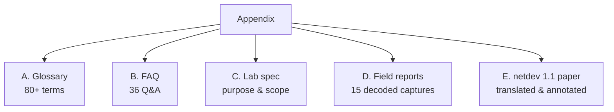

# 附录

正文章节按学习路径组织，而有些内容天然是"查"而不是"读"的：术语、常见问题、实验室规格、抓包字段级报告。附录把它们集中起来，作为阅读正文与标准原文时的常备速查。

附录包含五部分：

- **[附录 A：术语表（中英对照）](A_glossary.md)**：80+ 条按主题分组的术语速查，Ctrl+F 搜英文或中文都行
- **[附录 B：FAQ 三十六问](B_faq.md)**：概念/密钥/帧格式/运维/选型五类常见问题，每条答案带出处
- **[附录 C：实验室规格](C_spec.md)**：本书实验室的目的、范围与交付物定义
- **[附录 D：抓包字段级报告](D_reports.md)**：15 份由 `make generate` 生成的逐字段偏移报告导读
- **[附录 E：netdev 1.1 论文全译](E_netdev_paper.md)**：Linux 内核 MACsec 设计文档的中文全译，插图高清重制，并附 2026 年过时内容核对

