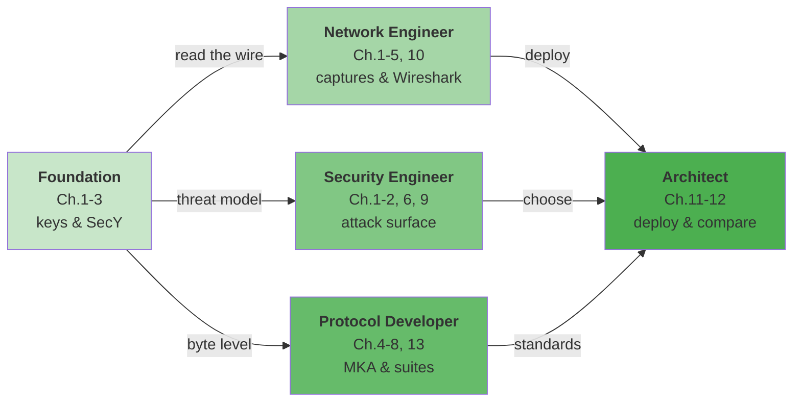

<div align="center">

<h1>MACsec 学习指南</h1>

<p>
<a href="LICENSE"></a>
<a href="https://github.com/johnfu-ai/macsec-study-guide"></a>
<a href="https://johnfu-ai.github.io/macsec-study-guide/"></a>
<a href="tests/test_protocol.py"></a>
<a href="captures/"></a>
</p>

<p><em>IEEE 802.1AE / 802.1X MKA 知识库与可验证实验室：从密钥体系到字节级报文，从攻击面到真实部署</em></p>

</div>

---

## 关于本书

以太网主宰着数据中心、运营商网络与企业园区，但原生以太网帧是明文的：任何能接触到链路的设备都可以嗅探、篡改、重放流量。MACsec（IEEE 802.1AE）在链路层为以太网补上了这一课——逐帧认证与加密，对上层协议完全透明；而它的密钥自动化，则由 802.1X 体系中的 MKA 协议完成。

《MACsec 学习指南》是关于 MACsec 与 MKA 的体系化知识库，同时是一个**可验证的实验室**：15 个 Wireshark 可直接打开的参考抓包、与 IEEE 官方测试向量逐字节对齐的密码学实现（GCM-AES-128/256、AES-CMAC、AES-KeyWrap，ICV 可验、SAK 可解），外加覆盖协议、密钥、攻防、部署与选型的十三章正文。书里的每一个关键论断，都能在某个 pcap 或某条测试断言里找到证据。

无论你是希望看懂 MACsec 抓包的网络工程师、评估二层加密方案的安全工程师，还是准备落地部署的架构师，都能从本书中获得完整的知识路径。

---

## 目标读者

- **网络工程师**：需要看懂 MACsec/MKA 报文、诊断链路加密故障
- **安全工程师**：需要理解二层加密的攻击面、能力边界与缓解手段
- **协议与内核开发者**：需要字节级格式、密钥派生细节与标准条款对照
- **架构师与技术管理者**：需要在 MACsec / IPsec / TLS / WireGuard 之间做选型决策
- **网络专业学生与研究者**：希望系统学习 IEEE 802.1AE / 802.1X 而非碎片化教程

---

## 你将学到什么

阅读本书后，你将能够：

1. **掌握 MACsec 的密钥体系**
   - 分清 CAK / CKN / KEK / ICK / SAK 五个对象各自的角色与派生关系
   - 理解 PSK 与 EAP 两条鉴权路线如何殊途同归
   - 看懂 SAK 如何经 AES-KeyWrap 封装后在 MKA 中分发

2. **读懂每一条报文**
   - SecTAG 的 TCI/AN/SL/PN/SCI 逐比特布局
   - MKPDU 全部参数集（Basic / Peer List / Distributed SAK / SAK Use）逐字段偏移
   - 用 Wireshark 验证 MKA ICV、解开 SAK、展开加密载荷

3. **理解生命周期的每个环节**
   - 换钥（AN=0 → AN=1）、PN 耗尽、XPN 的 64 位序号
   - 接收端重放窗口的四种裁决与 Delay Protect
   - 对等体判死之后数据面的命运

4. **建立攻防与选型的判断力**
   - nonce 复用、延迟重放、降级、组密钥等攻击面的原理与证据
   - MACsec 与 IPsec / TLS / WireGuard 的逐维度对比与叠加使用
   - Linux、交换机、网卡卸载等真实部署路径

---

## 本书特色

- **知识库 + 实验室一体**：每个主题都有成体系的正文，也有可打开、可复现的 pcap
- **密码学可验证**：实现与 IEEE 公开 GCM 测试向量逐字节对齐，35 项测试随时可跑
- **字段级解析**：不依赖 Wireshark 密钥表的自有解析器，为每份抓包生成偏移级报告
- **中英对照**：80+ 术语双语术语表，方便对照标准原文阅读

---

## 阅读建议

本书采用循序渐进的结构，建议按顺序阅读：

- **第一部分（第 1-3 章）** 建立基础认知：MACsec 是什么、密钥体系、SecY 数据面
- **第二部分（第 4-8 章）** 深入协议细节：MKA、字节级报文、生命周期、套件与拓扑
- **第三部分（第 9-12 章）** 攻防与实战：攻击面、动手实验、部署与协议对比
- **第四部分（第 13 章与附录）** 标准演进、术语表、FAQ 与字段级报告

对于时间有限的读者，可优先阅读第 1 章、第 2 章、第 5 章和第 9 章，快速建立整体认知。

---

## 五分钟快速上手

体验"可验证实验室"，只需这 3 个步骤：

1. **跑测试（1 分钟）**：`make test`——35 项断言里，IEEE 官方 GCM 向量逐字节比对
2. **开抓包（2 分钟）**：`make generate` 后用 Wireshark 打开 `captures/session-full.pcap`，过滤 `mka || macsec`
3. **搞破坏（2 分钟）**：在 `tests/` 里改掉任何一个常量（密钥/PN/AAD），看哪条断言先挂——挂掉的顺序就是概念重要性的顺序

完成这 3 步，你就摸到了这本书的"证据链"：正文里的每个论断都指向某帧报文或某条断言。

---

## 学习路线图



### 学习角色对比

| 角色 | 推荐章节 | 学习重点 | 预期成果 |
|------|---------|---------|---------|
| **网络工程师** | 第 1-5、10 章 | 抓包导读、字段解析、Wireshark、排障 | 能独立诊断 MACsec 链路问题 |
| **安全工程师** | 第 1-2、6、9 章 | 重放/降级/组密钥攻击面与缓解 | 能评估二层加密方案的能力边界 |
| **协议开发者** | 第 4-8、13 章 | MKA 状态机、套件、标准条款对照 | 能按标准实现或审计协议栈 |
| **架构师** | 第 1、11-12 章 | 部署路径、四协议选型与叠加 | 能制定链路层加密方案 |

---

## 作者说明

本书的参考抓包由仓库内的纯 Python 实现生成，密码学与 IEEE 公开测试向量对齐；写作环境为 WSL2（内核未开启 `CONFIG_MACSEC`），因此数据面帧不是内核卸载产物，而是按 802.1AE 组织、密码学可验的构造帧。MACsec 标准仍在演进，建议结合第 13 章的标准地图持续追踪修订。

---

## 推荐阅读

本书是链路安全丛书的一部分。以下仓库与本书形成互补：

| 书名 | 与本书的关系 |
|------|------------|
| [ipsec-study-guide](https://github.com/johnfu-ai/ipsec-study-guide) | 网络层加密的姊妹实验室，与第 12 章对比互为参照 |
| [ieee-802.1x-study-guide](https://github.com/johnfu-ai/ieee-802.1x-study-guide) | EAPOL/EAP-TLS 受控端口实验，本书 EAP 路线的前篇 |

---

## 快速开始

### 在线阅读

👉 **推荐**：[在线阅读（GitHub Pages）](https://johnfu-ai.github.io/macsec-study-guide/)

### 本地阅读（Honkit）

```bash
npm install        # 安装 Honkit（一次性）
make serve         # http://localhost:4000 热重载预览
```

### 离线构建

```bash
make book          # 生成 _book/ 静态站点，可离线浏览或自行托管
```

### 运行实验室

```bash
python3 -m pip install -r requirements.txt   # 只需要 cryptography
make test         # 35 项：IEEE 向量 + 加解密往返
make generate     # 生成 captures/*.pcap 与字段级报告
make verify       # 测试 + tshark 协议识别（15 项）
sudo make lab     # 可选：netns + veth 线上重放实验
```

---

## 参与贡献

欢迎贡献！您可以通过以下方式参与：

- 🐛 [提交 Issue](https://github.com/johnfu-ai/macsec-study-guide/issues) — 报告错误或提出建议
- 📝 [提交 PR](https://github.com/johnfu-ai/macsec-study-guide/pulls) — 改进内容或修复 typo
- ⭐ Star 本项目 — 帮助更多人发现这本书

---

## 免责声明

本书只用于理解 IEEE 802.1AE / 802.1X MKA 的帧格式与密钥关系。

- 不要把仓库里的密钥、镜像或脚本部署到生产或你没有明确授权的网络。
- `captures/keys.json` 与代码中的 CAK/SAK 是**演示材料**，一克隆就视为已泄露。
- 作者不对误用承担责任。
- 本书的格式，参考了https://github.com/yeasy/ai_security_guide

---

## 许可证

本书采用 [MIT](LICENSE) 许可证。IEEE 标准文本本身不在本仓库；实现按公开条款（802.1X 9.x / 11.x 图、802.1AE Clause 9/14、Randall GCM 测试向量）编写。
